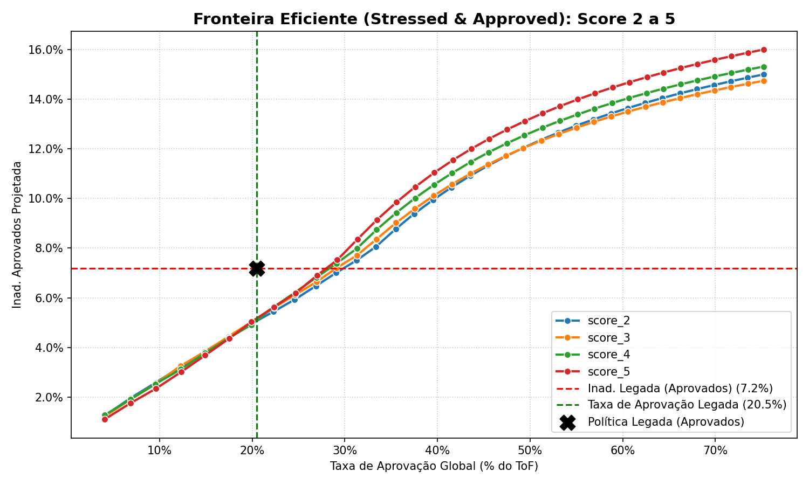
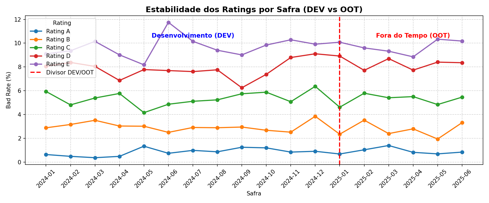
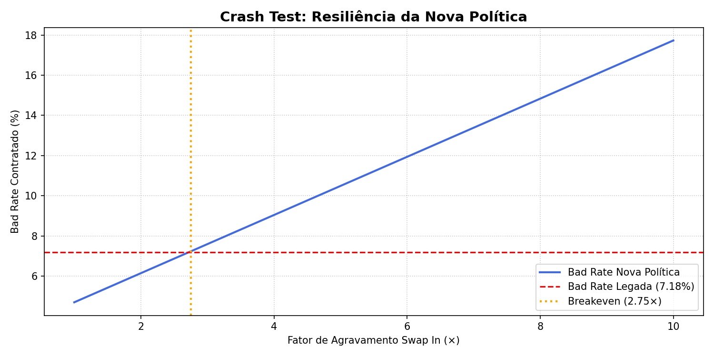

# 📊 PyCrediTools
*Credit Risk Simulation, Policy Optimization, and Risk Clustering for Python*

[](https://www.python.org/downloads/)
[](https://opensource.org/licenses/MIT)
[]()

---

**PyCrediTools** is a state-of-the-art Python library developed specifically for Credit Risk teams. It provides high-performance computational engines for **Decision Funnel Simulation (Policy Trade-off)** and **Autonomous Risk Clustering (Risk Ratings)**.

Forget the trial-and-error approach. With PyCrediTools, you can test bureau hard filters, simulate and optimize score cutoffs per region, and cluster your approved portfolio into contiguous risk ratings (A to E) in a mathematically optimal and temporally stable manner.

---

## 🚀 Installation

The package can be installed directly from the GitHub repository:

```bash
pip install git+https://github.com/matheuspasche/pycreditools.git
```

---

## 💡 Core Features

- **Credit Policy Simulation**: Design decision funnels composed of multiple stages (bureau hard filters, score cutoff rules, variable take-up rate stages).
- **Automated Risk Clustering**: Group score bands into "Risk Ratings" (A to E) under strict business constraints (monotonicity of default rates, minimum volume per group, and longitudinal safra/vintage stability).
- **Monotonic Sorting Kernel**: (New!) Ensures ratings for single-score setups are strictly contiguous and ordered, preventing score overlaps or inversions (higher scores always mapped to better or equal ratings).
- **Longitudinal Stability**: The Ward linkage engine calculates and enforces vintage risk separation over multiple periods of observation.

---

## 📖 Use Case: Replacing a Legacy Policy (Showcase V14)

This section demonstrates the real-world usage of the library to simulate and validate the replacement of a legacy policy (`legacy_score` with a single p78 cutoff) with a new champion model (`score_5`) regionalized by store/region.

The complete execution and validation flow is available in [tutorial_masterclass_v14.ipynb](tutorial_masterclass_v14.ipynb).

### 1. Modeling the Approval Funnel (Bureau + Entry Rules)
We apply the new entry hard filters and include the active score cutoff for direct comparison of the cumulative funnel over the applicant base:

```python
import pandas as pd
from pycreditools import CreditPolicy, col

# We create the base policy with hard entry filters
policy_hf = (
    CreditPolicy(
        applicant_id_col="applicant_id",
        score_cols=["score_2", "score_3", "score_4", "score_5"],
        current_approval_col="approved",
        actual_default_col="actual_default",
        time_col="safra"
    )
    .filter("CPF Válido", col("cpf_valido") == True)
    .filter("Teto Negativação", col("vl_negativacao") <= 1500)
    .filter("Teto Atraso SCR", col("vl_vencido_scr") <= 3000)
    .filter("Teto Protestos", col("vl_protestos") <= 500)
)

# We add the active cutoff on the legacy comparison policy
policy_legacy_hf = (
    policy_hf
    .filter("Ponto de Corte Vigente", col("legacy_score") >= LEGACY_CUT)
)
```

The resulting cumulative approval funnel (including the active cutoff):

| Stage | Volume | % Funnel | Δ Stage |
| :--- | :---: | :---: | :---: |
| **Top of Funnel** | 667,348 | 100.0% | — |
| **After Valid CPF** | 666,017 | 99.8% | -0.2% |
| **After Negativization Ceiling** | 604,823 | 90.6% | -9.2% |
| **After SCR Ceiling** | 565,019 | 84.7% | -6.6% |
| **After Protest Ceiling** | 528,232 | 79.2% | -6.5% |
| **After Active Score Cutoff** | 136,711 | 20.5% | -74.1% |
| **Post-all HF (combined)** | **136,711** | **20.5%** | **—** |

---

### 2. Optimization Curve and Efficient Frontier
We evaluate the four candidate scores (`score_2` to `score_5`) comparing their approval rate against projected default. The Efficient Frontier chart below displays the performance of each model, highlighting the legacy policy performance with an **"X"**.



*The **Score 5** clearly dominates the efficiency frontier. At the same approval rate as the legacy policy (~20.4%), it projects a drastically lower approved default rate. We proceed with the final calibration using only it.*

---

### 3. Regional Flat Default Rate Optimization by Store
To optimize capital allocation and credit limits by region, we replace the flat approval strategy with a **Flat Default Rate** policy. We calibrate regional score cutoffs to achieve a stable target of **5.80% local Stressed PD**, allowing approval rates to float depending on local applicant quality.

```python
# Regional cutoffs to target 5.80% stressed PD
cutoffs_loja = {
    "Centro-Oeste": 804,
    "Nordeste": 806,
    "Norte": 794,
    "Sudeste": 778,
    "Sul": 776,
}

def politica_loja(df_in):
    passa = pd.Series(False, index=df_in.index)
    for loja, cut in cutoffs_loja.items():
        passa.loc[(df_in["region"]==loja) & (df_in["score_5"]>=cut)] = True
    return passa

policy_final = (
    policy_hf
    .filter("Score Regionalizado Flat PD", politica_loja)
    .rate("Propensão de Contrato", base_rate=1.0, variable="take_up_rate")
)
```

Regional statistics resulting from final policy simulation:

| Region / Store | Score Cutoff | Local Approval Rate | Stressed PD |
| :--- | :---: | :---: | :---: |
| **Centro-Oeste** | 804 | 18.37% | 5.54% |
| **Nordeste** | 806 | 16.94% | 5.67% |
| **Norte** | 794 | 17.67% | 5.79% |
| **Sudeste** | 778 | 22.32% | 5.86% |
| **Sul** | 776 | 23.33% | 5.83% |

---

### 4. Risk Grouping (Clustering) on Survivors
We classify applicants **approved under the new policy (survivors)** in DEV using the Ward clustering engine to generate contiguous Ratings. The engine guarantees 100% consistent contiguity and ordering.

```python
# Trained on the approved survivor population
df_train_dev = res_final[
    (res_final["new_approval"] > 0.0) &
    (res_final["sample"] == "DEV")
].copy()

group_res = fit_risk_groups(
    data=df_train_dev,
    score_cols="score_5",
    default_col="actual_default",
    bins=30,
    max_groups=5,
    min_vol_ratio=0.01,
    method="ward",
    time_col="safra",
    max_crossings=1
)
```

The resulting Ratings structure and its temporal validation:

| Rating | Score 5 Range | DEV Default | OOT Default | DEV Vol (Approved) | OOT Vol (Approved) |
| :---: | :---: | :---: | :---: | :---: | :---: |
| **A** | `941` to `1000` | 1.66% | 1.69% | 42,205 | 19,642 |
| **B** | `890` to `940`  | 4.05% | 4.31% | 27,381 | 12,860 |
| **C** | `870` to `889`  | 5.77% | 5.73% | 14,181 | 6,667  |
| **D** | `822` to `869`  | 8.01% | 8.11% | 36,879 | 17,719 |
| **E** | `776` to `821`  | 10.22%| 10.74%| 18,421 | 9,005  |

Below, we plot the temporal stability of observed performance vintages for approved applicants under the new policy, proving that risk segregation remains robust and overlap-free throughout the entire history:



---

### 5. Swaps and Decision Quadrants Dissection
The policy transition changes portfolio composition. We evaluate the observed performance for clients rejected by the new policy but accepted by the legacy one (Swap Out) vs the stressed performance of new accepted clients (Swap In):

| Quadrant | Expected Hired Volume | Default Rate | Data Source |
| :--- | :---: | :---: | :--- |
| **Keep In** | 68,912 | 4.54% | Observed (`actual_default`) |
| **Swap In** | 23,159 | 10.11% | Simulated Stressed (Angled) |
| **Swap Out** | 25,952 | 14.33% | Observed Historical Legacy |
| **Keep Out** | 0 | N/A | No data (Rejected by both) |

> [!NOTE]
> For **Swap Ins** simulation (Magnum), we use an **Angled Aggravation** strategy to conservatively price adverse selection. Stress is applied incrementally by risk Rating (from best to worst), penalizing riskier ratings more heavily:
> - **Rating A**: 1.20x (+20% stress)
> - **Rating B**: 1.30x (+30% stress)
> - **Rating C**: 1.40x (+40% stress)
> - **Rating D**: 1.40x (+40% stress)
> - **Rating E**: 1.50x (+50% stress)

Here is the code snippet where we define and apply this angled aggravation by risk Rating using the `CustomStress` class:

```python
from pycreditools import CustomStress

# Angled Swap In Aggravation (A=1.2x to E=1.50x)
def angulado(df_swap, pd_col):
    mapa = {"A": 1.20, "B": 1.30, "C": 1.40, "D": 1.40, "E": 1.50}
    fator = df_swap["Rating"].map(mapa).fillna(1.4)
    return (df_swap[pd_col] * fator).clip(0, 1)

policy_magnum = (
    policy_final
    .add_stress(CustomStress(angulado))
)
```

---

### 6. Expected Volume and Risk Balance (P&L)
The new structured policy achieves a highly balanced result for expected P&L:
1. **Healthy Acquisition**: With a far superior predictive engine (Score 5), we approve lower-risk applicants. By calibrating the conversion/take-up rate to reflect actual customer appetite (ranging from **41%** for the best scores to **95%** for the lowest), we mitigate adverse selection.
2. **Efficient Swap**: We successfully swap high-risk legacy customers (**Swap Out** with **14.33%** default rate) for qualified new customers (**Swap In** with an expected default rate of **10.11%**, even under a rigorous angled stress scenario).
3. **Win-Win Effect**: The final simulation demonstrates that we reduce the overall default rate from **7.18% to 5.94%** (a **-17.3%** reduction in total risk under angled stress) while expected contract volume remains solid at **92,071** (compared to 94,675 legacy, a small planned reduction of **-2.8%** to ensure operational resilience).

---

### 7. Executive P&L Impact Summary (Delta Table)
The consolidated comparison between the policies proves the success of the new simulation framework:

| Metric | Legacy Policy | New Policy (Flat PD) | Absolute Delta | Relative Delta |
| :--- | :---: | :---: | :---: | :---: |
| **Global Approval (% ToF)** | 20.47% | **20.50%** | **+0.02%** | **+0.1%** |
| **Hired Default Rate (P&L)** | 7.18% | **5.94%** | **-1.24%** | **-17.3%** |
| **Expected Hired Volume** | 94,675 | **92,071** | **-2,604** | **-2.8%** |

---

### 8. Crash Test: Swap In Resilience (Stress & Breakeven)
Since Swap In performance is simulated, we perform a stress test by varying the default multiplier from **1.0x** to **10.0x** on this population to find the breakeven point with the legacy policy.



*The **breakeven point is reached at 2.25x**. This means the actual Swap In default rate would have to be **2.25 times higher** than estimated by the model (even after angled stress) to match the legacy loss of **7.18%**. This 125% resilience buffer proves the safety and robustness of the new regional Flat PD policy.*

---

### 9. Export and Production Integration (Decision Engines)
The library allows you to export the decision logic directly to production engines and microservices. The `DeploymentPolicy` exposes clean serializations to evaluate applicants:

* **Clean Rules Export**: Generates a JSON file containing only the logic expressions and continuous score bands of each Rating. This is ideal for decision engines written in Go, Java, Node.js, or SQL.
  ```python
  dep_policy = policy.export(rating_recipe=group_res.recipe)
  dep_policy.save("politica_producao.json", clean=True)
  ```

* **Clean Exported JSON**:
  ```json
  {
      "funnel_stages": [
          { "position": 1, "name": "CPF Válido", "type": "filter", "expression": "(cpf_valido == True)" },
          { "position": 2, "name": "Corte Regional por Loja", "type": "filter", "expression": "(region == 'Sudeste' & score_5 >= 778) | (region == 'Nordeste' & score_5 >= 806)" }
      ],
      "rating_classification": {
          "score_column": "score_5",
          "segmentation_column": "region",
          "segments": {
              "Sudeste": [
                  { "rating": "A", "min_score": 928, "max_score": 1000 },
                  { "rating": "B", "min_score": 890, "max_score": 927 },
                  { "rating": "C", "min_score": 778, "max_score": 889 }
              ]
          }
      }
  }
  ```

* **Standardized and Immutable Prediction Outputs**:
  The `.predict(df, simple=True)` method returns an isolated copy containing standard execution columns (`decision`, `reason`, `hired`, `defaulted`, `scenario`, `rating`).
  - **Simplified output (simple=True)**: Great for API logs and production audit trails.
  - **Analytical output (simple=False)**: Includes all intermediate calculation steps (individual PDs, stage-by-stage pass rates) for deep modeling.

---

## 📖 Advanced Features: Dynamic Rates and Custom Stress Scenarios

This section details how to use custom functions/callables and expressions for contract take-up rates (`RateStage`) and custom stress scenarios (`CustomStress`).

### 1. Dynamic Rates with Functions and Expressions

When defining a credit policy, the contract take-up rate (conversion) is rarely flat. It varies depending on the client's risk profile. 

In PyCrediTools, you can define take-up rates dynamically using **lambdas/callables** or **Expression objects**:

#### Option A: Using a Custom Callable (Function)
You can pass a function to the `variable` argument of `RateStage`. The function receives the applicant DataFrame and must return a pandas Series of multipliers (or probabilities).

```python
import pandas as pd
from pycreditools import CreditPolicy

# Dynamic take-up function based on score deciles
def calculate_take_up(df_in):
    # Dynamically divide scores into deciles on the incoming population
    deciles = pd.qcut(df_in["score_5"], q=10, labels=False, duplicates="drop")
    # Take-up rate goes from 95% (best scores) to 41% (worst scores)
    return 0.95 - deciles * 0.06

policy = (
    CreditPolicy(
        applicant_id_col="applicant_id",
        score_cols=["score_5"],
        current_approval_col="approved",
        actual_default_col="actual_default"
    )
    .rate("Contract Propensity", base_rate=1.0, variable=calculate_take_up)
)
```

#### Option B: Using a Symbolic Expression
You can also use PyCrediTools expressions for math-based dynamic scaling:

```python
from pycreditools import CreditPolicy, col

# Multiplier scales with income
dynamic_multiplier = col("income") / 10000.0

policy = (
    CreditPolicy(
        applicant_id_col="applicant_id",
        score_cols=["score_5"],
        current_approval_col="approved",
        actual_default_col="actual_default"
    )
    .rate("Contract Propensity", base_rate=0.8, variable=dynamic_multiplier)
)
```

---

### 2. Custom Stress Scenarios with Functions

You can test policy resilience by adding a `CustomStress` scenario using a python function. The function receives the Swap In DataFrame and the name of the column containing the baseline calibrated PD (`pd_col`), and returns the stressed PDs:

#### Example: Angled Stress by Rating
Apply incremental stress depending on the assigned risk rating:

```python
from pycreditools import CustomStress

def angled_stress_scenario(df_swap, pd_col):
    # Multiplier map by risk rating
    rating_map = {"A": 1.20, "B": 1.30, "C": 1.40, "D": 1.40, "E": 1.50}
    stress_factor = df_swap["rating"].map(rating_map).fillna(1.40)
    
    # Return stressed PDs clipped between 0.0 and 1.0
    return (df_swap[pd_col] * stress_factor).clip(0.0, 1.0)

# Add custom stress to the policy
stressed_policy = policy.add_stress(CustomStress(angled_stress_scenario))
```

---

### 3. Custom Risk Calibration Settings

By default, the simulator builds quantile-based risk calibration bins on the approved Keep In population (using between 5 and 20 dynamic quantiles depending on data size).

For advanced simulations, you can override this behavior to:
- Calibrate on a specific score column (`score_col`).
- Use a custom number of bins or a list/tuple of custom score edges to ensure monotonicity (`bins`).
- Calibrate using the entire global dataset distribution (`base="global"` / `"all"`) so that the same bin/decile represents the exact same score band across different policies.

Use the `.with_calibration()` fluent builder method:

```python
# Configure global decile (10 bins) risk calibration
policy = (
    CreditPolicy(
        applicant_id_col="applicant_id",
        score_cols=["score_3", "score_5"],
        current_approval_col="approved",
        actual_default_col="actual_default"
    )
    .cutoff("Score Cutoff", {"score_5": 750})
    .with_calibration(
        score_col="score_5", 
        bins=10, 
        base="global"
    )
)
```

You can also pass explicit score thresholds to handle custom risk bands:

```python
# Custom risk bands to enforce monotonicity
custom_bands = [0, 680, 720, 760, 800, 840, 880, 1000]

policy = policy.with_calibration(bins=custom_bands)
```

#### Calibrating Funnel Transition Rates (e.g. Contract / Approved)
You can also use the `.calibrated()` modifier on any mathematical expression. The simulator will evaluate the expression on the historically approved population, group the results by the policy's calibration bins/edges, and automatically map these calculated rates to all candidates during the simulation.

This is highly generalist and lets you dynamically estimate transition rates (like contract take-up rate `col("hired") / col("approved")`) without writing any custom Python functions:

```python
from pycreditools import col

# Option A: Using the .calibrated() modifier on the expression
policy = (
    policy
    .rate("Contract Rate", base_rate=1.0, variable=(col("hired") / col("approved")).calibrated())
)

# Option B (Recommended): Using the calibrate=True parameter directly on the rate stage
policy = (
    policy
    .rate("Contract Rate", base_rate=1.0, variable=col("hired") / col("approved"), calibrate=True)
)
```

#### 🛡️ Deterministic Keep In Rate Stage Bypass
During simulations, applicants who belong to the **Keep In** population (historically approved) bypass the stochastic drawing of rate stages:
- **Pre-approval stages** (like anti-fraud): they pass deterministically with a rate of `1.0` (since they passed historically).
- **Conversion stages** (like take-up/hiring): their pass status is mapped directly to their actual observed historical conversion outcome (provided by `current_hired_col` in the policy configuration).

This prevents stochastic noise from polluting historical data outcomes and keeps results mathematically sound.

---

## 🛠️ Contribution and Development

To run unit tests:
```bash
git clone https://github.com/matheuspasche/pycreditools.git
cd pycreditools
pip install -e .
pytest tests/
```

## 📜 License
Distributed under the MIT License. Developed for credit risk modeling and financial risk engineering.
