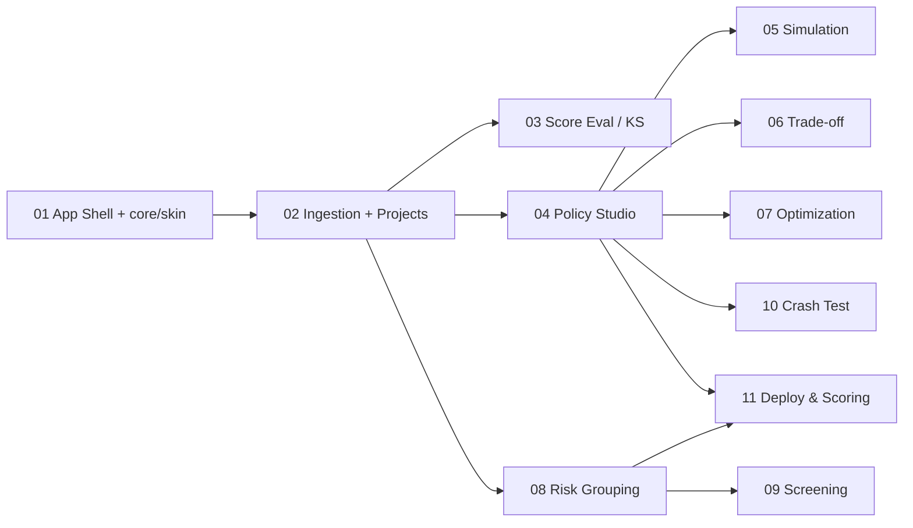

# PROGRESS — which PRD to implement (single source of truth)

> This file is the **work queue**. A fresh agent reads it to know which PRD to do.
> Each agent updates its row's **Status** as it goes. Do not track progress
> anywhere else.

## 👉 Which PRD do I implement now?

**Your PRD = the FIRST row in the table below whose Status is NOT `DONE`.**

Then handle its current status:
- **`TODO`** → this is your PRD. First confirm every PRD listed in its
  **Depends on** column is already `DONE` (the row order guarantees this — if a
  dependency is somehow not `DONE`, **STOP** and tell the owner). Then **mark it
  `IN PROGRESS`** (see below) and implement it.
- **`IN PROGRESS`** → a previous session already started this PRD. Read what
  exists in the repo, **continue/finish it** — do not restart from scratch unless
  it's empty or broken. Don't skip to a later PRD.
- **`AWAITING APPROVAL`** → this PRD is implemented and its 4 validation layers
  passed, but the owner hasn't approved yet. **Do NOT re-implement and do NOT start
  the next PRD.** Re-show the Gate Report and ask the owner to approve.

Never work on more than one PRD. Never start the next row until the current one is
`DONE`.

## How to update your row

1. **On start** (status was `TODO`): set Status → `IN PROGRESS`, then
   `git commit -m "chore(studio): start PRD <NN>"` (PROGRESS.md only).
2. **When all 4 validation layers are green** (guide §3): set Status →
   `AWAITING APPROVAL`, produce the **Gate Report** (guide §4), and **STOP**.
3. **After the owner replies "aprovado"**: set Status → `DONE`, fill the **Done**
   date (YYYY-MM-DD), then `git commit -m "chore(studio): PRD <NN> approved"`,
   then `git push origin feature/gui-streamlit-studio` (the **one** push for this
   PRD — everything before this stays local). **STOP** — do not begin the next
   PRD in this session.

If the owner requests changes instead of approving: keep Status `AWAITING APPROVAL`,
apply the fixes, re-run all 4 layers, re-issue the Gate Report.

## Status legend
`TODO` · `IN PROGRESS` · `AWAITING APPROVAL` · `DONE`

## Queue (top to bottom = build order; take the first non-DONE row)

| # | PRD file | Depends on | Status | Done |
|---|----------|-----------|--------|------|
| 01 | [01-app-shell-and-design-system.md](01-app-shell-and-design-system.md) | — | DONE | 2026-06-25 |
| 02 | [02-data-ingestion-and-projects.md](02-data-ingestion-and-projects.md) | 01 | DONE | 2026-06-25 |
| 03 | [03-score-evaluation.md](03-score-evaluation.md) | 02 | AWAITING APPROVAL | |
| 04 | [04-policy-studio.md](04-policy-studio.md) | 02 | TODO | |
| 05 | [05-simulation-and-impact.md](05-simulation-and-impact.md) | 04 | TODO | |
| 06 | [06-tradeoff-and-scenarios.md](06-tradeoff-and-scenarios.md) | 04 | TODO | |
| 07 | [07-cutoff-optimization.md](07-cutoff-optimization.md) | 04 | TODO | |
| 08 | [08-risk-grouping-and-ratings.md](08-risk-grouping-and-ratings.md) | 02 | TODO | |
| 09 | [09-risk-screening.md](09-risk-screening.md) | 08 | TODO | |
| 10 | [10-crash-test.md](10-crash-test.md) | 04 | TODO | |
| 11 | [11-deployment-and-scoring.md](11-deployment-and-scoring.md) | 04, 08 | TODO | |

> Note: `<NN>` in commit messages = the row number (01–11). The PRD file name also
> carries it. When all rows are `DONE`, the v1 studio is complete (00-overview §12).

## Dependency map (visual)

Renders on GitHub / VS Code (Mermaid). Arrows = "must be DONE before". The table
above carries live status; this graph carries structure.



## What each PRD delivers — your gate briefing

At each gate the agent tells you **"validate this now / don't expect that yet"**
(guide §4). This is the source for that briefing — what becomes testable in the
running app when the PRD is `DONE`:

- **01** — App opens (dark theme, sidebar, guards) + the core/skin skeleton & test
  scaffold. *No analysis pages yet.*
- **02** — Upload a CSV or generate sample data; auto-detected column roles;
  save/load a project.
- **03** — KS ranking of your scores + decile (KS) table.
- **04** — Build a policy by clicking (filters/cutoff/rate + flat stress) with a
  live funnel preview.
- **05** — Run the policy: approval/bad rate, swap quadrants, compare vs baseline.
- **06** — Efficient frontier + conservative/neutral/aggressive scenario picker.
- **07** — Grid-search optimal cutoffs + Pareto frontier.
- **08** — Risk ratings A–E (clustering) + vintage-stability chart.
- **09** — Sub-segments inside ratings ranked by IV (screening).
- **10** — Crash test: breakeven stress factor.
- **11** — Export the policy JSON + batch-score an uploaded file.

> So, e.g., during PRD 04 don't try to validate ratings (PRD 08) or deployment
> (PRD 11) — they aren't built yet. The agent will spell this out at each gate.

## Visual board (live kanban)

For a terminal kanban derived from the table above (always accurate — single
source of truth), run:

```bash
python scripts/prd_board.py
```

It prints the PRDs grouped by status (`TODO` / `IN PROGRESS` / `AWAITING APPROVAL`
/ `DONE`), marks the next actionable PRD, and flags any blocked by dependencies.

### GitHub Projects board (already set up — mirrors this file)

Live board: **https://github.com/users/matheuspasche/projects/5** (issues #5–#15,
one per PRD, in `matheuspasche/pycreditools`). In the project view, switch to
**Board** and **Group by Label** to get status columns.

**Agents: this is not optional housekeeping — it's part of every status change.**
Any time you edit a Status cell in the table above, immediately run, in the same
step:

```bash
python scripts/github_board.py sync
```

It updates each issue's `status:todo|in-progress|review|done` label, opens/closes
the issue, and sets/clears `blocked` from the dependency column — purely derived
from this file. **This file (`PROGRESS.md`) is still the single source of truth**;
the sync is best-effort (skip with a one-line note if `gh` isn't
installed/authenticated — never let it block a gate). First-time setup (already
done once; re-run only if recreating the board) was
`gh auth login -s project -w` then `python scripts/github_board.py setup`.
